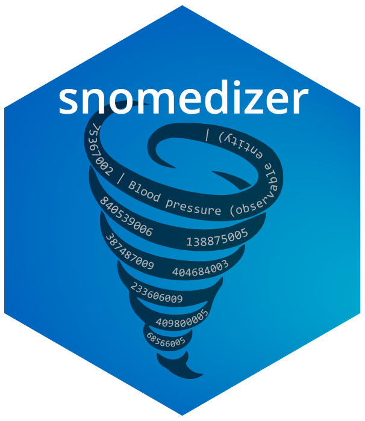
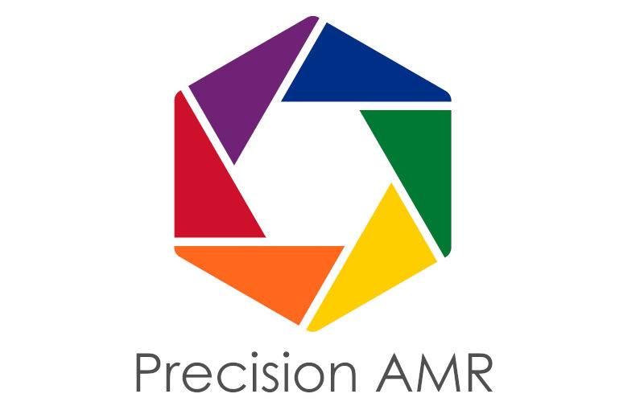

<!-- README.md is generated from README.Rmd. Please edit that file -->

# <code>snomedizer</code>: R Interface to the SNOMED CT Terminology Server REST API

<!-- badges: start -->

[](https://github.com/ramses-antibiotics/snomedizer/actions)
[](https://codecov.io/gh/ramses-antibiotics/snomedizer?branch=master)
[](https://www.repostatus.org/#wip)
<!-- badges: end -->

<p class="lead">
<code>snomedizer</code> is an R package to manipulate the SNOMED
clinical ontology using the [SNOMED CT Terminology Server REST
API](https://github.com/IHTSDO/snowstorm).
</p>

## Installation

<!-- 
You can install the released version of snomedizer from [CRAN](https://CRAN.R-project.org) with:

``` r
install.packages("snomedizer")
```
-->

You can install the development version from
[GitHub](https://github.com/ramses-antibiotics/snomedizer) with:

``` r
install.packages("devtools")
devtools::install_github("ramses-antibiotics/snomedizer")
```

## Example

`snomedizer` provides a direct interface to the SNOMED CT Terminology
Server REST API.

By default, the package uses the public [SNOMED International
server](https://browser.ihtsdotools.org/snowstorm/snomed-ct/) available
for reference purposes **only** (see [terms &
conditions](#terms--conditions)).

For example,
[`GET /branch/concepts`](https://snowstorm.ihtsdotools.org/snowstorm/snomed-ct/swagger-ui.html#!/Concepts/findConceptsUsingGET)
is implemented in `api_concepts()`:

``` r
library(snomedizer)
api_concepts(term = "pneumonia", activeFilter = TRUE)
#> Response [https://snowstorm.ihtsdotools.org/snowstorm/snomed-ct/MAIN/concepts?term=pneumonia&limit=50&offset=0&activeFilter=TRUE]
#>   Date: 2021-08-02 14:53
#>   Status: 200
#>   Content-Type: application/json
#>   Size: 22 kB
#> {
#>   "items" : [ {
#>     "conceptId" : "233604007",
#>     "active" : true,
#>     "definitionStatus" : "FULLY_DEFINED",
#>     "moduleId" : "900000000000207008",
#>     "effectiveTime" : "20150131",
#>     "fsn" : {
#>       "term" : "Pneumonia (disorder)",
#>       "lang" : "en"
#> ...
```

Simpler wrapper functions are available for common operations, which
provide results as data frames:

``` r
concepts_find(term = "pneumonia", limit = 5) %>% 
  dplyr::select(conceptId, fsn.term, pt.term) 
#> Warning: 
#> This server request returned just 5 of a total 589 results.
#> Please increase the server `limit` to fetch all results.
#>   conceptId                         fsn.term            pt.term
#> 1 233604007             Pneumonia (disorder)          Pneumonia
#> 2 161525004 History of pneumonia (situation)     H/O: pneumonia
#> 3 416916004    Lipoid pneumonitis (disorder) Lipoid pneumonitis
#> 4 300999006       Basal pneumonia (disorder)    Basal pneumonia
#> 5 278516003       Lobar pneumonia (disorder)    Lobar pneumonia
```

## Development and new features

Please share your experience as a user!

Do not hesitate to [get in touch on
GitHub](https://github.com/ramses-antibiotics/snomedizer/issues) to
report bugs or request new features.

## Terms & conditions

### Server endpoint

By default, `snomedizer` queries the [public SNOMED CT terminology
endpoint](https://snowstorm.ihtsdotools.org/snowstorm/snomed-ct/swagger-ui.html)
hosted by SNOMED International.

This server has no service level agreement and **MUST NOT be used as
part of production systems in healthcare settings**, even if you hold a
SNOMED CT licence.

Please refer to the [Snowstorm
documentation](https://github.com/IHTSDO/snowstorm/blob/master/docs/getting-started.md)
for instructions on how to build a dedicated endpoint for production.

### SNOMED CT Terminology

In order to use SNOMED CT terminology, a licence is required which
depends both on the country you are based in, and the purpose of your
work.

SNOMED International maintains a public SNOMED CT terminology server for
strict ‘reference purposes’ under the [SNOMED International SNOMED CT
Browser License Agreement](https://browser.ihtsdotools.org/).

Use of SNOMED CT terminology for data analysis or health care production
systems is subject to other licences. Some users are eligible for free
licences:

-   UK-based users can obtain a licence free of charge on the [NHS TRUD
    website](https://isd.digital.nhs.uk/trud3).
-   residents of other Member Countries and low-income countries are
    also eligible. More information can be found on the [SNOMED
    International website](https://www.snomed.org/snomed-ct/get-snomed).

## Funders

<div style="display: table-cell;">

<a href="https://www.nihr.ac.uk/"></a>
  
<a href="https://esrc.ukri.org/"></a>
  
<a href="https://www.ucl.ac.uk/infection-immunity/people/professor-judith-breuer/precision-amr"></a>

</div>

## Code of conduct

The `snomedizer` project is released with a [Contributor Code of
Conduct](CODE_OF_CONDUCT.md).

By contributing to this project, you agree to abide by its terms.
