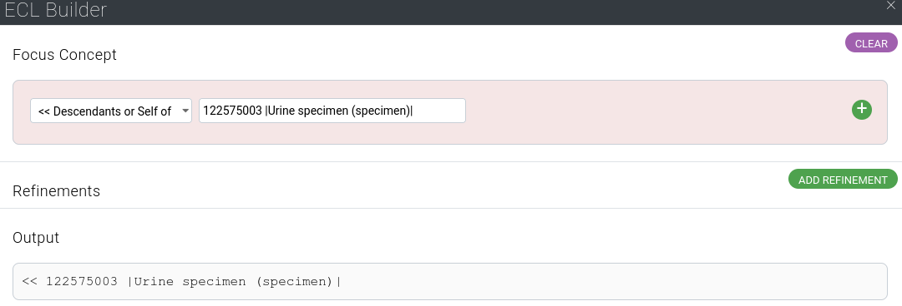

```{r setup, include=FALSE}
knitr::opts_chunk$set(echo = TRUE)
library(snomedizer)
library(dplyr)
```

# About SNOMED CT

SNOMED CT is an international ontology of clinical terms. You can think of it as an encyclopedia on all things that are talked about in medicine, for instance: anatomical structures, diagnoses, medications, tests,  surgical procedures, pathogens such as SARS-CoV-2 or *Candidida auris*, or even clinical findings, such as a high temperature.

SNOMED CT is used mainly in the UK

* to record information about patient care in general practice and hospitals
* to analyse electronic health records, in particular medical notes.

Increasingly, other countries are contributing towards and using SNOMED CT.

The best ways to learn more about SNOMED CT are

* the [SNOMED CT International Browser](https://browser.ihtsdotools.org/)
* the [SNOMED CT for Data Analysts](https://elearning.ihtsdotools.org/enrol/index.php?id=26) free online learning course
* the official [SNOMED CT Starter Guide](http://snomed.org/sg), particularly chapters [5. SNOMED CT Logical Model](http://snomed.org/sg/5.+SNOMED+CT+Logical+Model) and [6. SNOMED CT Concept Model](http://snomed.org/sg/6.+SNOMED+CT+Concept+Model)..


# Browse and query SNOMED CT

SNOMED CT contains rich knowledge about medical concepts.

Try for yourself in the quick exercise below:

1. Go to the [SNOMED CT International Browser](https://browser.ihtsdotools.org/) 
2. In the 'Search' tab, type in `40600002` 
3. Click on 'Pneumococcal bronchitis' in the result list
4. In the right panel ('Concept Details'), click the 'Details' tab
5. Look for the relationships: the ontology defines that this concept is a bronchitis, and that the pathological process is infectious (non-infective bronchites exist). It also specifies that the pathogen is *Streptococcus pneumoniae*
6. Now click on the 'Diagram' tab. The same information is displayed graphically. Purple boxes refer to `116680003 | Is a (attribute) |` relationships, while yellow boxes notate other attributes of the concept.
7. In the 'Refsets' tab, you will see that this concept is mapped to ICD-10 code J20.2.
8. Bonus: Search for `9861002` and inspect the various tabs. As you can see, SNOMED CT knows that *Streptococcus pneumoniae* is the scientific name of pneumonoccus, and that it is a gram-positive baterium of genus *Streptococcus*.

<div class="figure"></div>

# Advanced queries

SNOMED CT has a query language called [ECL (Expression Constraint Language)]( http://snomed.org/ecl). It is a very powerful tool to apply logics to learn new facts from a concept.

In this section, we will use the [SNOMED CT International Browser](https://browser.ihtsdotools.org/):

1. Please navigate to the [browser](https://browser.ihtsdotools.org/)
2. Click on the 'Expression Constraint Queries' tab in the right panel

## Finding relevant urine specimens

Urine tests are very common in hospitals, for instance for bacterial cultures. Let us assume we access a laboratory database in which all bacterial cultures are stored with SNOMED CT codes for the specimen type. There are many types of urine samples, such as morning urines, mid-stream samples, etc. Some are not good samples: for example, urine catheter samples are often contaminated and give poor information.

Let's try and fetch all the codes corresponding to urine specimens, which are descendants of `122575003 | Urine specimen (specimen) |`, while excluding the ones from urinary catheters (`122565001 | Urinary catheter specimen (specimen) |`).

1. Click the blue button 'ECL builder'
2. Select '<< Descendants or Self of' in the dropdown
3. Type `122575003` in the adjoining box and select the concept suggested by the browser
<div class="figure"></div>
4. Press 'OK', then 'Execute'. 
5. You can now see the 40 concepts that correspond to urinary sample.
6. In the expression, insert `MINUS <<122565001 | Urinary catheter specimen (specimen) |` after the existing query and press 'Execute'.
7. You can now see the 36 concepts returned by the browser, excluding 4 catheter specimen types.

For guidance on ECL operators such as `MINUS` or `AND`, click the 'Help' button or visit the [ECL quick reference table](https://confluence.ihtsdotools.org/display/DOCECL/Appendix+D+-+ECL+Quick+reference).

Using snomedizer, the same task can be conducted directly within R:

```{r}
library(dplyr)
library(snomedizer)
snomedizer_options_set(
  endpoint = "https://snowstorm.ihtsdotools.org/snowstorm/snomed-ct", 
  branch = "MAIN/2021-07-31"
)
urine_specimens <- concepts_find(
  ecl = "<<122575003 | Urine specimen (specimen) | 
           MINUS <<122565001 | Urinary catheter specimen (specimen) |")

str(urine_specimens[, c("conceptId", "pt.term")])
```


## Finding the dose of a medical product

Let's assume you have electronic prescription records referenced to SNOMED CT medical products. We come across a prescription for SNOMED CT code `374646004`, which references Amoxicillin 500 mg oral tablets. We want to extract (1) the antibiotic and (2) the dose to be administered.

Here we need to query *attributes*, which involves the `.` (dot) operator

1. In the 'Expression Constraint Queries' tab, type `374646004 . 762949000 |Has precise active ingredient (attribute)|` 
2. Press 'Execute'. The response is The response is `372687004 | Amoxicillin (substance) |`
3. In snomedizer:
```{r find_amox_drug}
concepts_find(ecl="374646004.762949000") %>% 
  select(conceptId, fsn.term)
```

<!-- Now for the dose,  -->
<!-- ```{r find_amox_drug} -->
<!-- concepts_find(ecl="374646004.1142135004 + 374646004.732945000") %>%  -->
<!--   select(conceptId, fsn.term) -->
<!-- ``` -->

<!-- 3. Then  -->

<!--  1142135004 |Has presentation strength numerator value (attribute)| = #500,  -->
<!--  732945000 |Has presentation strength numerator unit (attribute)| = 258684004 |milligram (qualifier value)|,  -->
<!--               1142136003 |Has presentation strength denominator value (attribute)| = #1,  -->
<!--               732947008 |Has presentation strength denominator unit (attribute)| = 732936001 |Tablet (unit of presentation)| } -->

<!--                 411116001 |Has manufactured dose form (attribute)| = 421026006 |Conventional release oral tablet (dose form)|,  -->
<!--         763032000 |Has unit of presentation (attribute)| = 732936001 |Tablet (unit of presentation)|,  -->
       
<!-- ## Finding drug-resistant organisms -->


<!-- 409799006 | Extended spectrum beta-lactamase-producing bacteria (organism) | -->
<!-- 734350003 | Carbapenemase-producing bacteria (organism) | -->

<!-- << 9861002 -->


# Practical uses of SNOMED CT

You may be a healthcare data scientist, or a researcher.

You may have access to healthcare datasets. Here are some examples how SNOMED CT can be useful.


* [identifying clinical concepts within free text data](prescription_indication_mapping.html), using SNOMED CT's list of known synonyms (or 'descriptions') for a given concept. For instance, `78048006` is has multiple descriptions: `Candidiasis` (preferred term); `Candidosis`; `Candida infection`; `Moniliasis`; `Monilia infection`; and `Thrush`
* reclassifying clinical concepts into broader ('parent') concepts (eg `40600002 | Pneumococcal bronchitis (disorder) |` is a `275498002 | Respiratory tract infection (disorder) |`)
* building taxonomies of concepts
* extracting stated/inferred attributes from the SNOMED CT ontology (eg the pathogen causing `40600002 | Pneumococcal bronchitis (disorder) |` is `9861002 | Streptococcus pneumoniae (organism) |`)


# Nice. What about snomedizer?

snomedizer is a package enabling you to query SNOMED CT in R. It is a simple interface to [Snowstorm](https://github.com/IHTSDO/snowstorm/), SNOMED International's terminology server, which works as a REST API.

Using snomedizer, you can perform all tasks directly within R:


