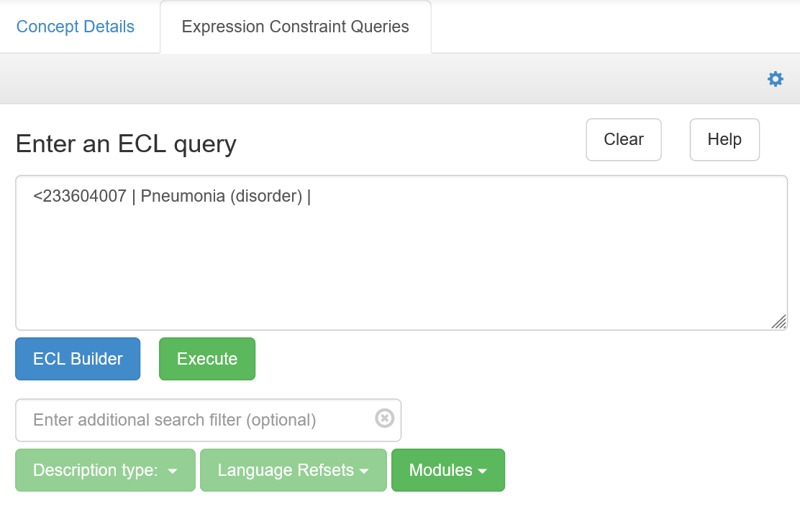

```{r setup, include=FALSE}
knitr::opts_chunk$set(echo = TRUE)
options(max.print = 15)
library(dplyr)
```
# Overview

## What is SNOMED CT?

SNOMED CT is the international standard ontology of clinical terms. It can be thought of as an encyclopedia on all things relevant to medicine, for instance: anatomical structures, diagnoses, medications, tests,  surgical procedures, pathogens such as SARS-CoV-2 or *Candida auris*, or even clinical findings, such as a high temperature.

SNOMED CT is not just a list of terms. It is an ontology made up of concepts which are fully defined in relation to each other. This allows complex inferences illustrated throughout the present vignette. You can learn more about ontologies in this [introduction workshop](https://github.com/nicolevasilevsky/CSH_IntroToOntologies/blob/master/IntroToOntologies_CSH_2018-10-28g.pdf) [@ontology101].

SNOMED CT is currently used in more than 80 countries. It is present in over 70% of clinical systems commercialised in Europe and North America [@snomed2020; @snomedvalue2021], and it is mandated across the English National Health Service for:

* records of symptoms, diagnoses, procedures, medications, observations or allergies [@SCCI0034]
* electronic prescribing and pathology laboratory systems [@DAPB4013; @DAPB4017].

The best ways to learn about SNOMED CT are:

* the [SNOMED International Browser](https://browser.ihtsdotools.org/)
* the [SNOMED CT for Data Analysts](https://elearning.ihtsdotools.org/enrol/index.php?id=26) free online learning course
* the official [SNOMED CT Starter Guide](http://snomed.org/sg), particularly chapters [5. Logical Model](http://snomed.org/sg/5.+SNOMED+CT+Logical+Model) and [6. Concept Model](http://snomed.org/sg/6.+SNOMED+CT+Concept+Model).

# Introduction to SNOMED CT

## Browsing the ontology

SNOMED CT contains rich knowledge about medical concepts.

Try for yourself with the quick exercise below:

1. Go to the [SNOMED CT International Browser](https://browser.ihtsdotools.org/?perspective=full) and accept licence terms.
2. In the 'Search' tab, type in `40600002`.
3. Click on 'Pneumococcal bronchitis' in the result list.
4. In the right panel ('Concept Details'), click the 'Details' tab.
5. Look for the relationships: the ontology defines that this concept is a bronchitis, and that the pathological process is infectious (non-infective bronchites exist). It also specifies that the pathogen is *Streptococcus pneumoniae*.
6. Now click on the 'Diagram' tab. The same information is displayed graphically. Purple boxes refer to `116680003 | Is a (attribute) |` relationships, while yellow boxes notate other attributes of the concept.
7. In the 'Refsets' tab, you will see that this concept is mapped to ICD-10 code J20.2.

<div class="figure"></div>

<!-- <div class="bd-callout bd-callout-info"> -->
<!-- <h4>Bonus exercise</h4> -->
<!-- <p>Search for <code>9861002</code> and inspect the various tabs. As you can see, SNOMED CT knows that<p> -->
<!-- <ul><li><i>Streptococcus pneumoniae</i> is the scientific name of pneumonoccus, and that</li>  -->
<!-- <li>it is a gram-positive baterium of genus <i>Streptococcus</i>.</li></ul></p> -->
<!-- </div> -->

## Performing advanced queries (ECL)

SNOMED CT has a query language named ['ECL' (Expression Constraint Language)](http://snomed.org/ecl). Using ECL, users can perform logical searches and learn new facts from any SNOMED CT concept using a range of operators listed in [this ECL quick reference table](https://confluence.ihtsdotools.org/display/DOCECL/Appendix+D+-+ECL+Quick+reference).

For instance, once can search for all the different subtypes of pneumonia. For this, we need to query the *descendants* of concept `233604007 | Pneumonia (disorder) |`.

The corresponding ECL query is `<233604007 | Pneumonia (disorder) |`, where `<` is the ECL operator selecting descendants of a concept.


<div class="bd-callout bd-callout-info">
<h4>Trying ECL in the web browser</h4>
<ul>
<li>Navigate to the [SNOMED International Browser](https://browser.ihtsdotools.org/?perspective=full)</li>
<li>Accept the licence conditions</li>
<li>Click on the 'Expression Constraint Queries' tab in the right panel</li>
<li>Paste ECL queries from this vignette into the 'Expression...' box as shown below</li>
<li>Press 'Execute'.</li>
</ul>
<br>
<div class="figure" style="text-align:center"></div>
</p>
</div>

# Examples

First, load and set up `snomedizer`.

```{r setup_snomedizer }
library(dplyr)
library(snomedizer)

# Connect to the SNOMED International endpoint
# (see licence conditions in `vignette("snomedizer")`).
snomedizer_options_set(
        endpoint = "https://snowstorm.ihtsdotools.org/snowstorm/snomed-ct",
        branch = "MAIN/2021-07-31"
)
```
## 1. Search for relevant urine specimens

Urine tests are commonly performed in hospitals, for instance when looking for bacteria (microbial cultures). Let's assume we access a laboratory database in which all bacterial cultures are stored with SNOMED CT codes for the specimen type.

There are many types of urine samples, eg: samples of morning urine, mid-stream urine, etc. Some are not optimal samples: for example, urine catheter samples are often contaminated and may give poor information.

Let's try and

* fetch all the codes corresponding to urine specimens: they are descendants of `122575003 | Urine specimen (specimen) |`
* while excluding the ones from urinary catheters (`122565001 | Urinary catheter specimen (specimen) |`).

First, we need to query descendant concepts. There are two ways to accomplish this in `snomedizer`:

* by using `concept_descendants()`
* by running an ECL query in the `concept_find(ecl = "...")` function. For this, you will want to use the `<<` operator (known as `descendantOrSelfOf`) using ECL.

All the expressions below are equivalent.

```{r demo_urine_1}
urine_specimens <- concept_descendants(conceptIds = "122575003",
                                       include_self = TRUE)
urine_specimens <- concept_find(ecl = "<<122575003")
urine_specimens <- concept_find(ecl = "<<122575003 | Urine specimen (specimen) |")
glimpse(urine_specimens[, c("conceptId", "pt.term")])
```
We obtain 40 concepts. But these include some samples obtained from catheters:

```{r demo_urine_2}
urine_specimens %>%
        filter(grepl("catheter", pt.term)) %>%
        select(pt.term)
```

To exclude those, we make use of the `MINUS` operator in ECL:

```{r demo_urine_3}
urine_specimens <- concept_find(
        ecl = "
  <<122575003 | Urine specimen (specimen) | MINUS
     ( <<122565001 | Urinary catheter specimen (specimen) |  OR
       <<447589008 | Urine specimen obtained by single catheterization of bladder (specimen) | )
  ")
glimpse(urine_specimens[, c("conceptId", "pt.term")])
```

This now gives us the set of 34 target concepts.

*Note:* For guidance on ECL operators such as `MINUS` or `OR`, see the [ECL quick reference table](https://confluence.ihtsdotools.org/display/DOCECL/Appendix+D+-+ECL+Quick+reference).


## 2. Find the dose of a medical product

Let's assume you have electronic prescription records referenced to SNOMED CT medical products. We come across a prescription for SNOMED CT code `374646004`, and want to extract the drug type, dose and unit.

<div class="bd-callout bd-callout-warning">
<h4>Note</h4>
<p>Medical product definitions vary considerably across SNOMED CT editions.</p>
<p>In this example, we will use the United States Edition.</p>
</div>

```{r look_med_prod}
med_product <- concept_find(conceptIds = "374646004",
                            branch = "MAIN/SNOMEDCT-US/2021-03-01")
med_product %>%
        select(conceptId, fsn.term, pt.term) %>%
        glimpse()
```